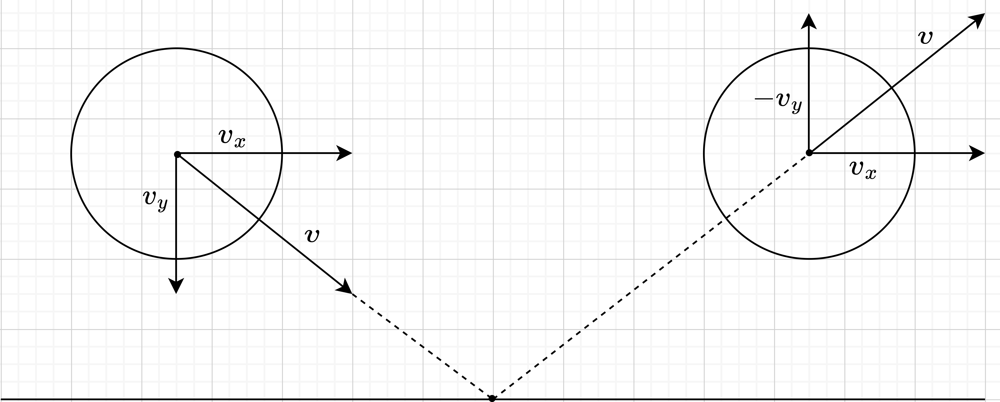
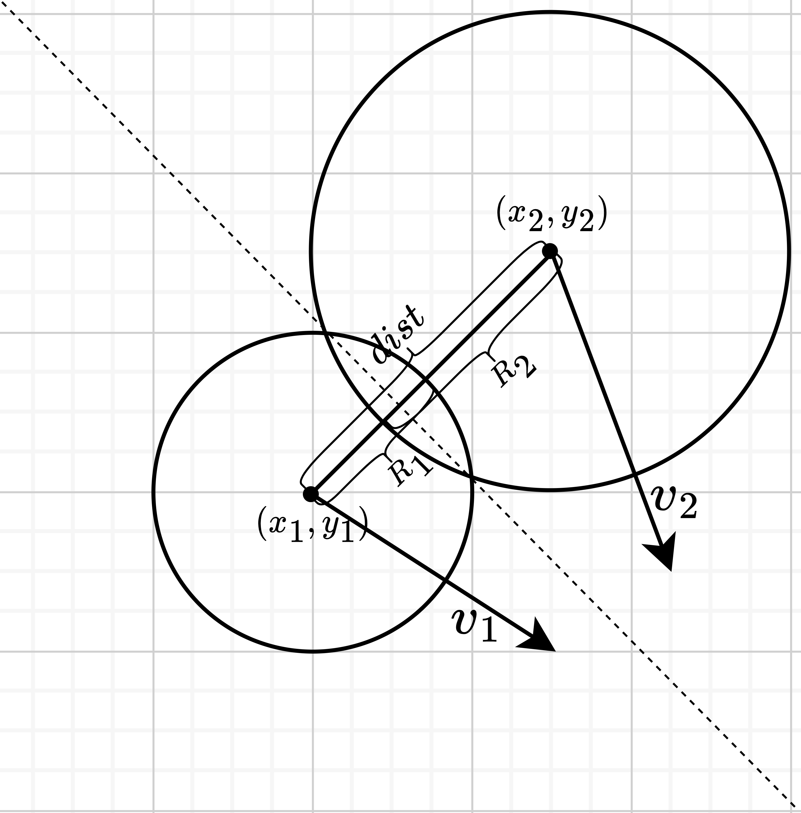

# Visualization of perfectly elastic collision

The repository contains implementations of the mathematical apparatus and visualization of the absolutely elastic collision of balls with the exchange of kinetic energy in two-dimensional space.


# Model setup

-  ```WIDTH``` and ```HEIGHT``` - field dimensions in pixels;
-  ```N_BALLS``` - the actual number of balls to be added (optimal value is from 0 to 100);
-  ```BALL_MIN_X_SPEED``` and ```BALL_MAX_X_SPEED``` - minimum and maximum initial speed for the ball along the x-axis;
- ```BALL_MIN_Y_SPEED``` and ```BALL_MAX_Y_SPEED``` - minimum and maximum initial speed for the ball along the y-axis;
- ```BALL_MIN_RADIUS``` and ```BALL_MAX_RADIUS``` - minimum and maximum ball radius (I recommend no more than 5% of the field size);
- ```BALL_X_ACCELERATION``` and ```BALL_Y_ACCELERATION``` - initial acceleration along the axes, if **less than 1** then the balls will **slow down** and the system will **lose** energy, if **more than 1** then the balls will **accelerate** and the system will **increase** energy and if **equal to 1** then the balls will move at a **constant speed** and the energy of the entire system will be **unchanged**;
- ```HANDLE_COLLISIONS``` - a boolean indicating that collisions should be handled, when set to ```False``` the balls will fly through each other;
- ```FPS``` - the number of frames per second, optimally 120, but depends on the performance of the hardware.

# Mathematical apparatus

## Ball representation

The mathematical model is two-dimensional, so $x$ and $y$ coordinates are sufficient for representation.\
\
In order to represent the movement of the ball on a plane, we will store the speed along the $x$ axis as $v_{x}$ and the $y$ axis as $v_{y}$, so the total speed is calculated by the formula $v=\sqrt{v_{x}^{2}+v_{y}^{2}}$.\
\
In order for the ball to move in time with different speeds, it is also necessary to store the acceleration along the $x$ axis as $a_{x}$ and the $y$ axis as $a_{y}$, so the total acceleration is calculated by the formula $a=\sqrt{a_{x}^{2}+a_{y}^{2}}$.\
\
Also, the ball needs a radius $R$ and a certain mass $m$, which will be calculated by the formula $m=k*R$, where $k$ is an arbitrary coefficient equal to 10.


## Ball moving

To move the ball, it is necessary to recalculate the coordinates and accelerations along axes in t seconds using the following formulas:

$$x=x+v_{x}*t$$

$$y=y+v_{y}*t$$

$$v_{x}=v_{x}*a_{x}$$

$$v_{y}=v_{y}*a_{y}$$

## Wall collision handling

When colliding with a wall, to reflect the ball from it, it is enough to invert the direction of movement along the corresponding axis:



## Balls collision

To check whether it is necessary to handle a collision between the balls, it is necessary to estimate the distance between their centers and, if it is less than or equal to the sum of the radii, process the collision. To indicate the overlap of balls (collisions), the following formula is used:

$$dist=\sqrt{(x_{1}-x_{2})^{2}+(y_{1}-y_{2})^{2}}$$

$$eps=10^{-3}$$

$$dist+eps\leq R_{1}+R_{2}$$



If the balls collided (an overlap was detected according to the formula above), then it is necessary to push the balls away from each other and recalculate the corresponding direction vectors and velocities.


First you need to calculate the normals for the axes:

$$n_{x}=\frac{x_{2}-x_{1}}{dist}$$

$$n_{x}=\frac{x_{1}-x_{2}}{dist}$$

Then the tangents for the axes are calculated:

$$tan_{x}=-n_{y}$$

$$tan_{y}=n_{x}$$

Next, the scalar product of the normals for each axis is calculated:

$$dpn_{1}=v_{1x}*n_{x}+v_{1y}*n_{y}$$

$$dpn_{2}=v_{2x}*n_{x}+v_{2y}*n_{y}$$

Calculate momentum for each axis:

$$p_{1} = \frac{dpn_{1} * (m_{1} - m_{2}) + 2*m_{2}*dpn_{2}}{m_{1}+m_{2}}$$

$$p_{2} = \frac{dpn_{2} * (m_{2} - m_{1}) + 2*m_{1}*dpn_{1}}{m_{1}+m_{2}}$$

We calculate the scalar product of tangents along the axes:

$$dptan_{1}=v_{1x}*tan_{x}+v_{1y}*tan_{y}$$

$$dptan_{2}=v_{2x}*tan_{x}+v_{2y}*tan_{y}$$

And finally we recalculate the speeds for both balls along each axis:

$$v_{1x}=tan_{x}*dptan_{1}+n_{x}*p_{1}$$

$$v_{1y}=tan_{y}*dptan_{1}+n_{y}*p_{1}$$

$$v_{2x}=tan_{x}*dptan_{2}+n_{x}*p_{2}$$

$$v_{2y}=tan_{y}*dptan_{2}+n_{y}*p_{2}$$
