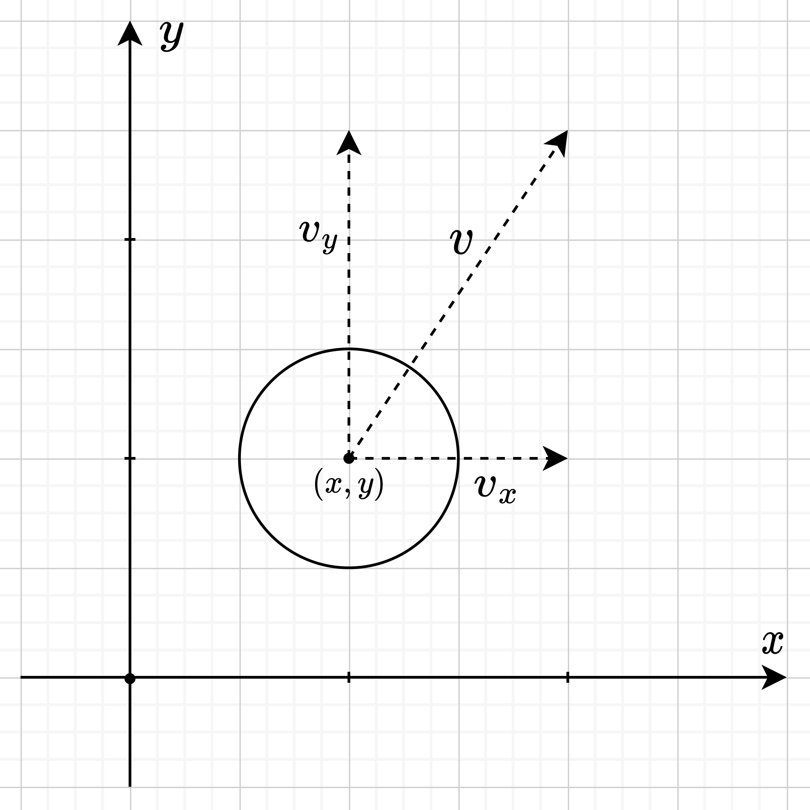

# Visualization of perfectly elastic collision

## Mathematical apparatus

### Representation

The mathematical model is two-dimensional, so $x$ and $y$ coordinates are sufficient for representation.\
\
In order to represent the movement of the ball on a plane, we will store the speed along the $x$ axis as $v_{x}$ and the $y$ axis as $v_{y}$, so the total speed is calculated by the formula $v=\sqrt{v_{x}^{2}+v_{y}^{2}}$.\
\
In order for the ball to move in time with different speeds, it is also necessary to store the acceleration along the $x$ axis as $a_{x}$ and the $y$ axis as $a_{y}$, so the total acceleration is calculated by the formula $a=\sqrt{a_{x}^{2}+a_{y}^{2}}$.\
\
Also, the ball needs a radius $R$ and a certain mass $m$, which will be calculated by the formula $m=k*R$, where $k$ is an arbitrary coefficient equal to 10.\
\
\
\
### Ball moving
To move the ball, it is necessary to recalculate the coordinates and accelerations along the $x$ and $y$ axes in $t$ seconds using the following formulas:

$$x=x+v_{x}*t$$

$$y=y+v_{y}*t$$

$$v_{x}=v_{x}*a_{x}$$

$$v_{y}=v_{y}*a_{y}$$

$$dist=\sqrt{(x_{1}-x_{2})^{2}+(y_{1}-y_{2})^{2}}$$

$$n_{x}=\frac{x_{2}-x_{1}}{dist}$$

$$n_{x}=\frac{x_{1}-x_{2}}{dist}$$

$$tan_{x}=-n_{y}$$

$$tan_{y}=n_{x}$$

$$dpn_{1}=v_{1x}*n_{x}+v_{1y}*n_{y}$$

$$dpn_{2}=v_{2x}*n_{x}+v_{2y}*n_{y}$$

$$p_{1} = \frac{dpn_{1} * (m_{1} - m_{2}) + 2*m_{2}*dpn_{2}}{m_{1}+m_{2}}$$

$$p_{2} = \frac{dpn_{2} * (m_{2} - m_{1}) + 2*m_{1}*dpn_{1}}{m_{1}+m_{2}}$$

$$dptan_{1}=v_{1x}*tan_{x}+v_{1y}*tan_{y}$$

$$dptan_{2}=v_{2x}*tan_{x}+v_{2y}*tan_{y}$$

$$v_{1x}=tan_{x}*dptan_{1}+n_{x}*p_{1}$$

$$v_{1y}=tan_{y}*dptan_{1}+n_{y}*p_{1}$$

$$v_{2x}=tan_{x}*dptan_{2}+n_{x}*p_{2}$$

$$v_{2y}=tan_{y}*dptan_{2}+n_{y}*p_{2}$$
